# modern-react-with-redux

Stephen Grider's Modern React with Redux on Udemy

Course link: [https://www.udemy.com/course/react-redux/](https://www.udemy.com/course/react-redux/)

## Syllabus

| No. | App          | Sections                                                                                                                                                                                                                                                                                    | Content                                                                                                                                                                                                                                                                                                 |
| --- | ------------ | ------------------------------------------------------------------------------------------------------------------------------------------------------------------------------------------------------------------------------------------------------------------------------------------- | ------------------------------------------------------------------------------------------------------------------------------------------------------------------------------------------------------------------------------------------------------------------------------------------------------- |
| 1   | jsx          | Section 1: Let's Dive In Section 2: Building Content with JSX                                                                                                                                                                                                                            | - npm - JSX                                                                                                                                                                                                                                                                                          |
| 2   | components   | Section 3: Communicating with Props                                                                                                                                                                                                                                                         | - functional components - props - semantic UI                                                                                                                                                                                                                                                     |
| 3   | seasons      | Section 4: Structuring Apps with Class-Based Components Section 5: State in React Components Section 6: Understanding Lifecycle Methods Section 26: More Fun with Hooks                                                                                                            | - class-based components - state - lifecycle methods - spinner - hooks                                                                                                                                                                                                                      |
| 4   | pics         | Section 7: Handling User Input with Forms and Events Section 8: Making API Requests with React Section 9: Building Lists of Records Section 10: Using Ref's for DOM Access                                                                                                         | - search bar - form change and submit - axios - render list - refs                                                                                                                                                                                                                          |
| 5   | videos       | Section 11: Let's Test Your React Mastery                                                                                                                                                                                                                                                   |                                                                                                                                                                                                                                                                                                         |
| 6   | songs        | Section 13: Integrating React with Redux                                                                                                                                                                                                                                                    | - action creator - action - dispatch - reducers - state - store - connect - combineReducers - mapStateToProps - provider                                                                                                                                                     |
| 7   | blog         | Section 14: Async Actions with Redux Thunk Section 15: Redux Store Design                                                                                                                                                                                                                | - thunk - applyMiddleware - lodash                                                                                                                                                                                                                                                                |
| 8   | streams      | Section 16: Navigation with React Router Section 17: Handling Authentication with React Section 18: Redux Dev Tools Section 19: Handling Forms with Redux Form Section 20: REST-based React Apps Section 21: Using React Portals Section 22: Implementing Streaming Video | - react-router - BrowserRouter - Link - authentication (oauth) - redux-dev-tools - composeEnhancers - redux-form - validation - REST APIs - CRUD - programmatic navigation - history - Switch (react-router) - react portal - react modal - react fragment |
| 9   | translate    | Section 23: The Context System with React Section 24: Replacing Redux with Context                                                                                                                                                                                                       | - contexts - provider/consumer - store component                                                                                                                                                                                                                                                  |
| 10  | hooks-simple | Section 25: Hooks with Functional Components                                                                                                                                                                                                                                                | - hooks for sharing logic                                                                                                                                                                                                                                                                               |
| 11  | NA           | Section 33: Bonus Topics                                                                                                                                                                                                                                                                    | - reselect - ReactCSSTransitionGroup                                                                                                                                                                                                                                                                 |

## Reducer Operations

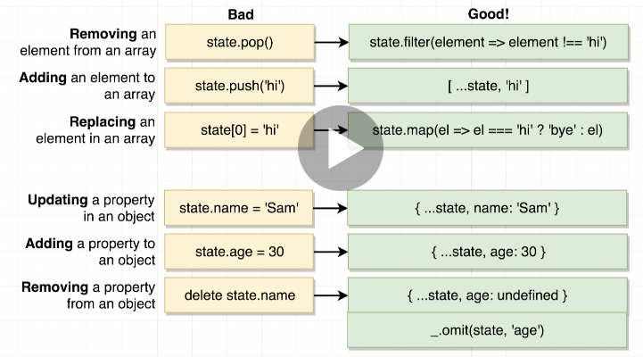

## Completed Apps

### 01_jsx

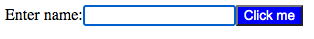

### 02_components

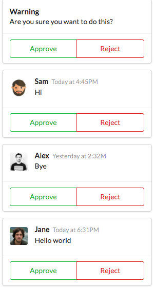

### 03_seasons

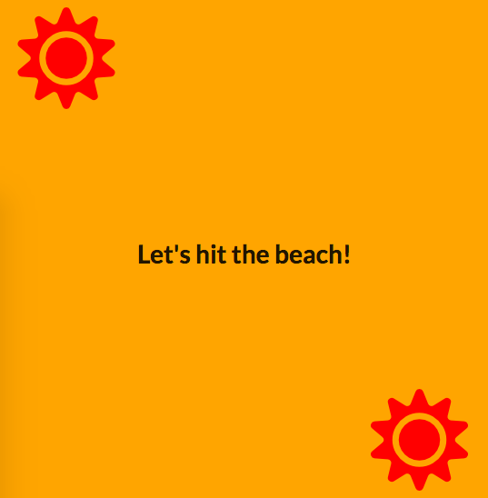

### 04_pics

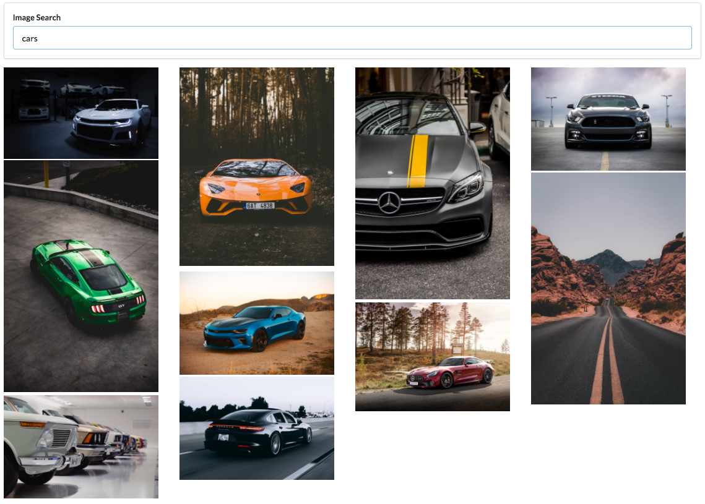

### 05_videos

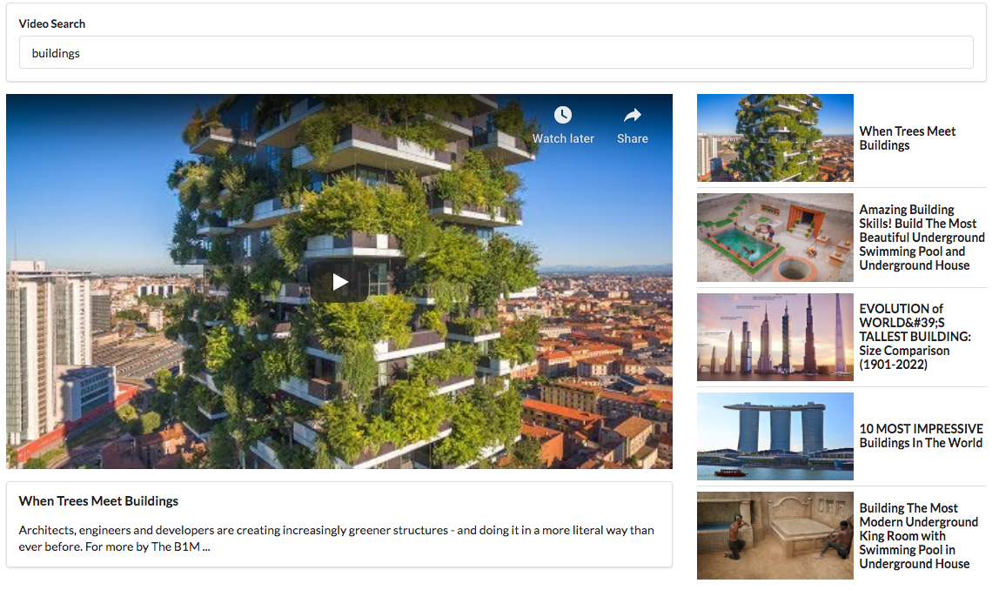

### 06_songs

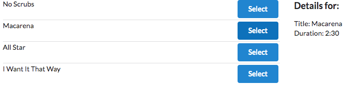

### 07_blog

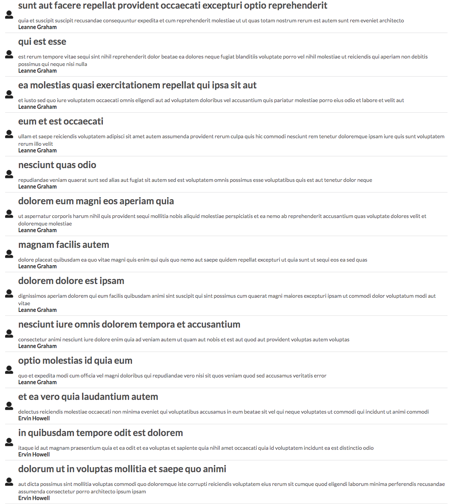

### 08_streams

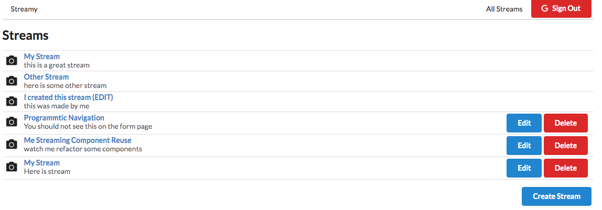
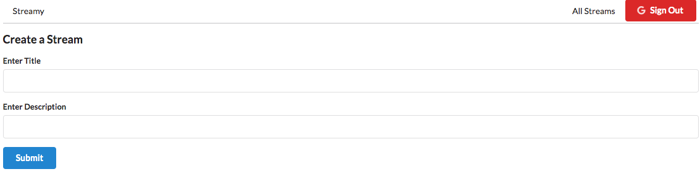
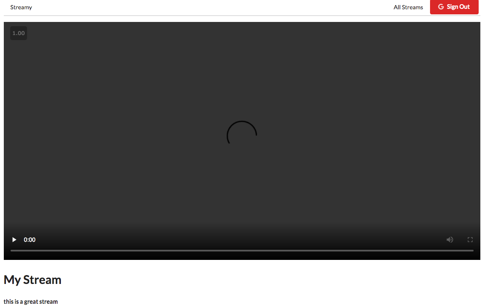

### 09_translate

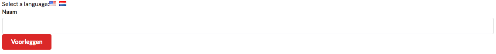

### 10_hooks-simple

